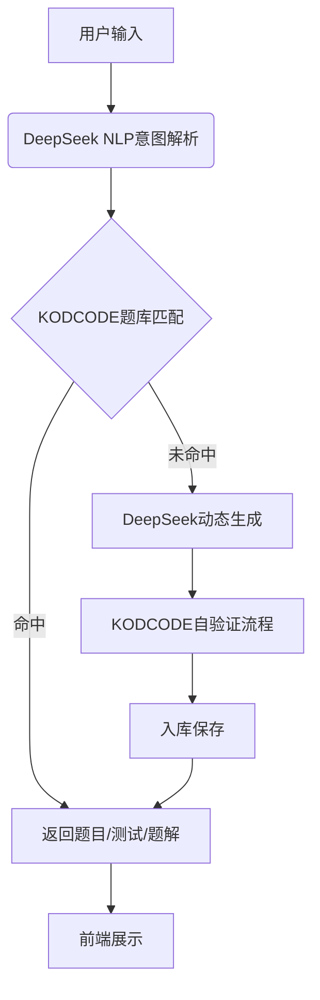
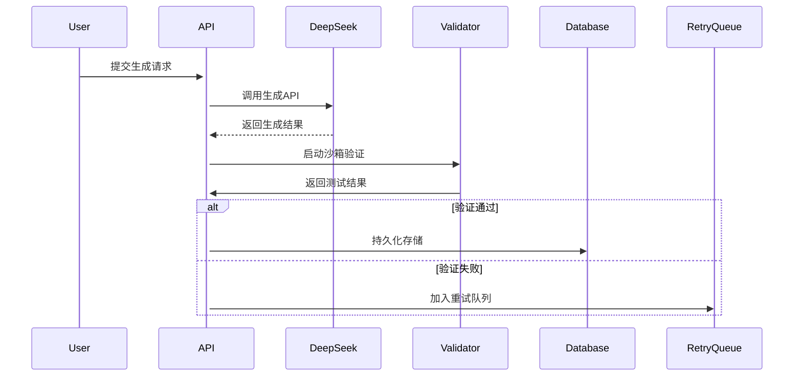

# 一、技术设计文档（Technical Design Document）

## 1. 项目概览

- 系统名称：DeepKod 代码训练平台
- 核心架构：微服务架构（前端 + API服务层 + 数据层）
- 技术栈：
  - 前端：
    - Unix(Ubuntu): terminal命令行支持
    - React: 前端框架
  - 后端：FastAPI + Celery（异步任务）
  - 存储：Elasticsearch + FAISS + MySQL
  - 基础设施：Docker + Kubernetes + Redis缓存

### 1.1 KodCode简介

项目库：[KodCode github仓库](https://github.com/KodCode-AI/kodcode?tab=readme-ov-file)

#### 1. 核心目标

**解决现有代码数据集的不足**：  
• **覆盖广度不足**：传统数据集（如APPS、CodeContests）覆盖范围有限，难以涵盖从基础编程到高级算法的多难度任务。  
• **验证缺失**：多数合成数据集缺乏单元测试验证，无法保证生成代码的正确性。  
• **多样性不足**：现有数据多集中于算法题，缺乏技术文档、软件包使用等真实场景问题。

#### 2. 实现过程

**三步流程设计**：  

1. **问题合成（Coding Question Synthesis）**  
   • **多样化来源**：从12类来源生成问题，包括：  
     ◦ 简单函数实现（MAGPIE-Prefill生成）  
     ◦ 算法题（LeetCode、Codeforces等人类数据增强）  
     ◦ 技术文档转换（如Flask、PyTorch文档生成实际问题）  
     ◦ 数据结构与算法知识库转化  
   • **去重策略**：使用FAISS计算语义相似度，过滤重复问题。

2. **解决方案与测试生成（Solution & Test Generation）**  
   • **自验证机制**：  
     ◦ 使用GPT-4o生成解决方案和单元测试。  
     ◦ 执行测试验证正确性，失败问题允许最多10次重试，避免过滤难题。  
   • **难度标签**：根据验证成功率自动标注问题难度（Easy/Medium/Hard）。

3. **后训练数据合成（Post-training Data Synthesis）**  
   • **格式多样化**：将问题改写为多种形式（如函数补全、工具调用）。  
   • **思维链生成**：用DeepSeek R1生成带推理步骤的响应，通过测试拒绝抽样保留高质量数据。

#### 3. 关键创新点

• **自验证流程**：首次将单元测试集成到数据生成中，确保解决方案100%通过测试。  
• **难题保留机制**：通过多次生成尝试（而非直接过滤）保留高难度问题。  
• **多维度多样性**：覆盖算法、软件包使用、技术文档等场景，支持不同编程需求。  
• **后训练优化**：生成带推理步骤的SFT数据，直接适配模型微调和强化学习。

#### 4. 实验结果

• **基准测试领先**：  
  • 在HumanEval(+)达到92.7%准确率，超过Qwen2.5-Coder-32B（90.9%）。  
  • BigCodeBench完整集准确率59.8%，较基线提升1.9%。  
• **困难任务提升显著**：  
  • BigCodeBench困难任务准确率37.8%（+4.7%），验证难题数据的有效性。

#### 5. 应用与展望

• **直接应用**：  
  • 监督微调（SFT）：提供447K已验证的问题-解决方案-测试三元组。  
  • 强化学习（RL）：单元测试作为自动奖励信号。  
• **未来方向**：  
  • 扩展竞赛级编程问题（如LiveCodeBench-Hard）。  
  • 探索仓库级代码生成数据。  
  • 优化数据选择策略，提升训练效率。

#### 6. 实现挑战与解决方案

• **挑战1：生成问题多样性**  
  → 混合12种数据源，结合语义去重和风格改写。  
• **挑战2：自验证失败处理**  
  → 允许10次重试，动态调整生成策略。  
• **挑战3：难度平衡**  
  → 根据验证通过率自动标注难度，按比例采样训练数据。

#### 7. 资源开放

• **数据集**：HuggingFace公开447K条数据（[链接](https://huggingface.co/KodCode)）。  
• **模型**：基于Qwen2.5-Coder-32B微调的SFT模型。  
• **工具链**：完整的数据生成与验证代码开源。

### 1.2 KodCode数据集

使用HuggingFace的`datasets`库加载数据，登录后：

```python
from datasets import load_dataset

# Login using e.g. `huggingface-cli login` to access this dataset
ds = load_dataset("KodCode/KodCode-V1")
```

## 2. 核心模块设计

### 2.1 核心架构设计



### 2.1 智能题目匹配引擎

​技术栈：HuggingFace Transformers + FAISS向量库

​实现步骤：

1. 将KODCODE的44.7万题目向量化（sentence-transformers/all-mpnet-base-v2）
2. 构建FAISS索引库实现毫秒级语义检索（支持"反转链表"匹配"单链表逆序操作"等变体）
3. 结合规则引擎处理特殊指令（如"我要中等难度的树结构题"解析为 difficulty=Medium & topic=Tree）”这个流程具体是如何实现的？我该如何一步步实现你的这个流程和模块

#### 智能题目匹配引擎分步实现指南

---

##### **步骤 1：环境准备与数据预处理**

1. **安装依赖库**

```bash
pip install sentence-transformers faiss-cpu elasticsearch pandas tqdm
```

1. **准备原始数据**

```python
# 示例数据结构（JSON格式）
{
  "id": "BST_001",
  "title": "二叉树前序遍历",
  "description": "使用递归方法实现二叉树前序遍历...",
  "difficulty": "Medium",
  "tags": ["树", "递归", "DFS"],
  "text": "二叉树前序遍历 递归实现 返回节点值列表"  # 合并的检索文本
}
```

1. **数据清洗脚本**

```python
def preprocess_data(raw_data):
    processed = []
    for item in tqdm(raw_data):
        # 合并关键字段
        search_text = " ".join([
            item["title"],
            item["description"],
            " ".join(item["tags"])
        ])
        
        # 保留核心字段
        processed.append({
            "id": item["id"],
            "text": clean_text(search_text),  # 去除非字母数字字符
            "difficulty": item["difficulty"].capitalize(),
            "metadata": {
                "data_structure": extract_main_tag(item["tags"]),
                "techniques": [t for t in item["tags"] if t not in DATA_STRUCTURE_TAGS]
            }
        })
    return processed
```

---

##### **步骤 2：文本向量化**

1. **加载预训练模型**

    ```python
    from sentence_transformers import SentenceTransformer

    model = SentenceTransformer('sentence-transformers/all-mpnet-base-v2', 
                            device='cuda' if torch.cuda.is_available() else 'cpu')
    ```

2. **批量生成向量**

    ```python
    def generate_embeddings(data):
        texts = [item["text"] for item in data]
        embeddings = model.encode(texts, 
                                batch_size=128,
                                show_progress_bar=True,
                                convert_to_tensor=True)
        return embeddings.cpu().numpy()
    ```

3. **保存向量数据**

    ```python
    import numpy as np

    embeddings = generate_embeddings(processed_data)
    np.save("kodcode_embeddings.npy", embeddings)
    ```

---

##### **步骤 3：构建FAISS索引**

1. **创建索引工厂**

    ```python
    import faiss

    dim = 768  # all-mpnet-base-v2的输出维度
    index = faiss.IndexFactory(dim, "IVF4096,Flat", faiss.METRIC_INNER_PRODUCT)
    ```

2. **训练索引**

    ```python
    index.train(embeddings)
    faiss.write_index(index, "trained_index.faiss")
    ```

3. **添加向量数据**

    ```python
    index.add(embeddings)
    faiss.write_index(index, "kodcode_index.faiss")
    ```

---

##### **步骤 4：实现混合检索系统**

1. **语义检索模块**

    ```python
    class SemanticSearcher:
        def __init__(self, index_path, metadata_map):
            self.index = faiss.read_index(index_path)
            self.metadata = metadata_map  # {id: metadata}
            
        def search(self, query, top_k=5):
            query_vec = model.encode([query])[0]
            distances, indices = self.index.search(query_vec.reshape(1, -1), top_k)
            return [self.metadata[i] for i in indices[0]]
    ```

2. **精确检索模块**

    ```python
    from elasticsearch import Elasticsearch

    es = Elasticsearch()

    # 创建ES索引映射
    es.indices.create(index="kodcode", body={
        "mappings": {
            "properties": {
                "difficulty": {"type": "keyword"},
                "data_structure": {"type": "keyword"},
                "techniques": {"type": "keyword"}
            }
        }
    })

    # 批量导入数据
    for doc in processed_data:
        es.index(index="kodcode", id=doc["id"], document=doc)
    ```

3. **混合排序算法**

    ```python
    def hybrid_rerank(semantic_results, exact_results):
        # 基于BM25和余弦相似度计算综合得分
        score_map = {}
        
        # 语义结果加权
        for i, res in enumerate(semantic_results):
            score = 0.7 * (1 - i/len(semantic_results))
            score_map[res["id"]] = score_map.get(res["id"], 0) + score
            
        # 精确匹配加权
        for res in exact_results:
            score_map[res["id"]] = score_map.get(res["id"], 0) + 0.3
            
        # 按总分排序
        sorted_ids = sorted(score_map.items(), key=lambda x: x[1], reverse=True)
        return [id for id, _ in sorted_ids]
    ```

---

##### **步骤 5：规则引擎实现**

1. **指令解析正则规则**

    ```python
    import re

    DIFFICULTY_PATTERN = r"(简单|容易|Easy)|(中等|Medium)|(困难|Hard|困难)"
    TOPIC_PATTERN = r"(树|链表|图|数组|字符串|二叉树)"

    def parse_instruction(query):
        rules = {
            "difficulty": None,
            "topic": None,
            "technique": None
        }
        
        # 解析难度
        diff_map = {"简单": "Easy", "中等": "Medium", "困难": "Hard"}
        if match := re.search(DIFFICULTY_PATTERN, query):
            rules["difficulty"] = diff_map.get(match.group(), "Medium")
            
        # 解析数据结构
        if match := re.search(TOPIC_PATTERN, query):
            rules["topic"] = match.group()
            
        # 解析技术点（示例）
        if "递归" in query:
            rules["technique"] = "递归"
        elif "迭代" in query:
            rules["technique"] = "迭代"
            
        return rules
    ```

2. **构建筛选器**

    ```python
    def build_es_query(rules):
        must_clauses = []
        
        if rules["difficulty"]:
            must_clauses.append({"term": {"difficulty": rules["difficulty"]}})
            
        if rules["topic"]:
            must_clauses.append({"term": {"data_structure": rules["topic"]}})
            
        if rules["technique"]:
            must_clauses.append({"term": {"techniques": rules["technique"]}})
            
        return {
            "query": {
                "bool": {
                    "must": must_clauses
                }
            }
        }
    ```

---

##### **步骤 6：系统集成与测试**

1. **完整检索流程**

    ```python
    def search_questions(query):
        # 规则解析
        rules = parse_instruction(query)
        
        # 精确检索
        es_query = build_es_query(rules)
        exact_results = es.search(index="kodcode", body=es_query, size=5)
        
        # 语义检索
        semantic_results = semantic_searcher.search(query)
        
        # 混合排序
        final_ids = hybrid_rerank(semantic_results, exact_results)
        
        return load_full_questions(final_ids)
    ```

2. **性能优化建议**
• **FAISS优化**：使用`IndexIVFPQ`进行量化压缩
• **缓存机制**：对常见查询结果进行Redis缓存
• **批量预处理**：预生成所有题目的关键词组合

---

##### **验证测试用例**

**测试输入 1**：`"中等难度的二叉树递归遍历题"`

```python
# 规则解析结果
{
  "difficulty": "Medium",
  "topic": "二叉树",
  "technique": "递归"
}

# ES查询生成
{
  "query": {
    "bool": {
      "must": [
        {"term": {"difficulty": "Medium"}},
        {"term": {"data_structure": "二叉树"}},
        {"term": {"techniques": "递归"}}
      ]
    }
  }
}
```

**测试输入 2**：`"反转链表的高效解法"`

```python
# 语义检索top3结果
[
  {"id": "LINKEDLIST_001", "title": "单链表逆序操作"},
  {"id": "LINKEDLIST_005", "title": "双向链表反转"},
  {"id": "ALGO_012", "title": "链表节点两两交换"}
]
```

---

##### **关键问题解决方案**

1. **冷启动问题**：
   • 预加载Top 1000常见题目的向量到内存
   • 使用`faiss.index_cpu_to_gpu()`加速初次检索

2. **语义相似度校准**：

   ```python
   # 领域适配微调
   model.fit(train_data=[
       ("反转链表", "单链表逆序操作"),
       ("二叉树层次遍历", "树的BFS实现"),
       ("两数之和", "数组元素求和查找")
   ], epochs=3)
   ```

3. **动态权重调整**：

    ```python
    def auto_adjust_weights(query_type):
        """根据查询类型动态调整混合权重"""
        if query_type == "模糊语义":
            return [0.8, 0.2]  # 侧重语义检索
        elif query_type == "精确条件":
            return [0.3, 0.7]  # 侧重精确匹配
        else:
            return [0.6, 0.4]
    ```

---

##### **实现路线图**

1. **第一阶段**：
   • 完成数据预处理和向量化
   • 实现基础FAISS索引构建
   • 搭建Elasticsearch服务

2. **第二阶段**：
   • 开发混合排序算法
   • 实现规则解析引擎
   • 构建基础API接口

3. **第三阶段**：
   • 性能优化与缓存集成
   • 编写单元测试
   • 部署到Docker容器

---

建议从数据预处理阶段开始逐步验证每个模块的功能，使用Jupyter Notebook进行原型验证后再转为生产代码。重点注意在不同检索场景下的质量评估，可通过人工抽检方式验证检索结果的相关性。

### 2.2 动态生成系统



## 3. 数据流设计

```csv
# 核心数据流转
用户输入 -> NLP解析 -> 混合检索 -> 结果排序 -> 动态生成(可选) -> 结果渲染
               ↑           ↓              ↓
          规则知识库   向量数据库      精确匹配引擎
```

## 4. API接口规范

### 4.1 题目检索接口

```yaml
POST /api/v1/questions/search
Params:
  - query: string (required)
  - difficulty: enum[Easy,Medium,Hard]
  
Response:
{
  "results": [
    {
      "id": "q_001",
      "title": "反转链表",
      "difficulty": "Medium",
      "acceptance_rate": 72.3,
      "preview": "实现链表反转函数...",
      "embedding_sim": 0.88
    }
  ]
}
```

## 5. 部署架构

```plaintext
                          ┌─────────────┐
                          │   CDN       │
                          └──────┬──────┘
                                 ↓
┌──────────┐   RESTful API  ┌────┴─────┐   Async   ┌───────────┐
│  Client  │ ◀─────────────▶│  API Server │───────▶│ Celery    │
└──────────┘                └────┬─────┘           └───────────┘
                                   ↓                      │
                            ┌──────┴──────┐               │
                            │  Redis      │               ↓
                            └──────┬──────┘       ┌────────────────┐
                                   ↓              │ Docker Swarm   │
                            ┌──────┴──────┐       │ - Validator    │
                            │  MySQL      │       │ - Sandbox      │
                            └─────────────┘       └────────────────┘
